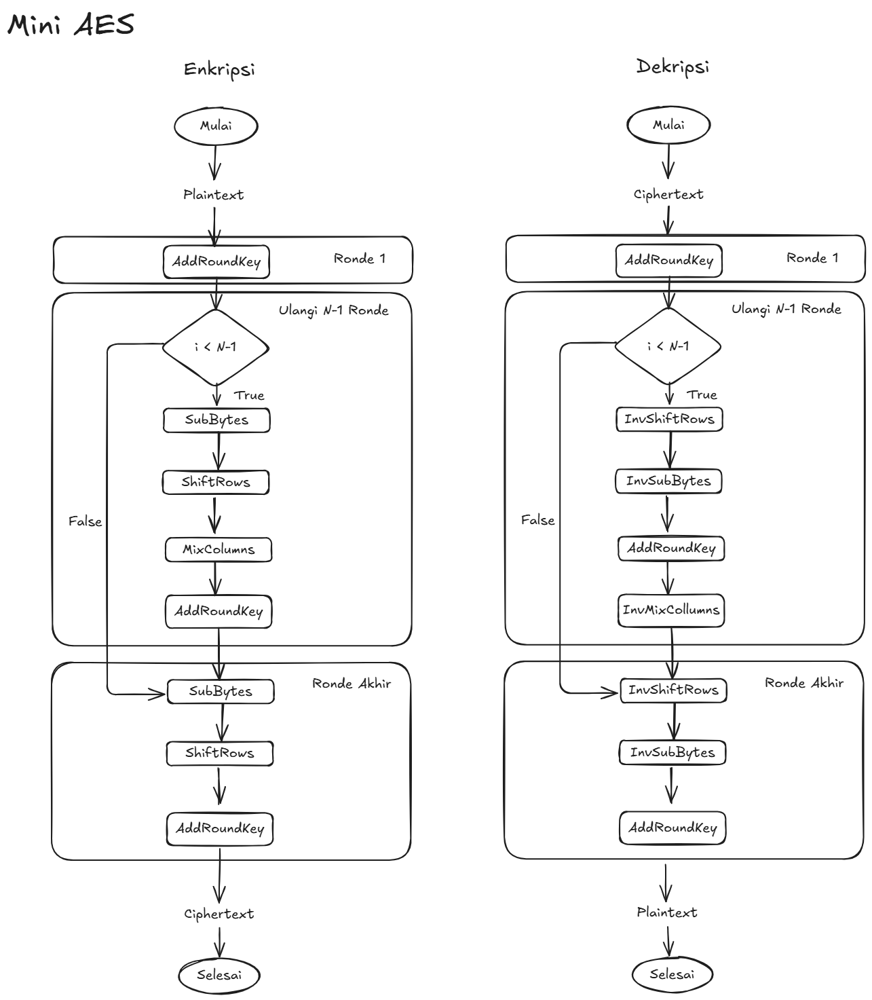
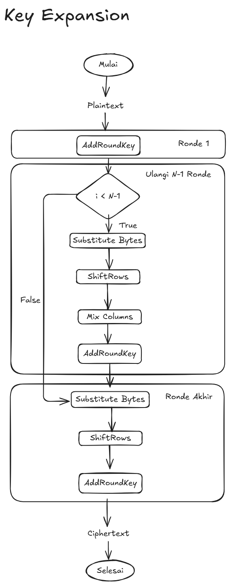

# Midterm Project (Mini-AES)

Kelas       : Kriptografi A

Project			: Mini-AES

Kelompok		: Kelompok 9

Anggota Kelompok:

| Nama | NRP |
| --- | --- |
| Gloriyano Daniel Cristho Pepuho | 5025201121 |
| Urdhanaka Aptanagi | 5025211123 |
| Immanuel Pascanov Samosir | 5025211257 |
| Muhammad Arkan K D | 5025211236 |
| Yehezkiel Wiradhika | 5025201086 |

--- 
> Note: just tmp, delete later

Dokumentasi (15 poin) – Github

- [x]  Spesifikasi algoritma Mini-AES (5)
- [x]  Flowchart Mini-AES dan Key Expansion (5)
- [ ]  Implementasi program
- [ ]  Penjelasan TestCase
- [ ]  Analisis: kelebihan dan keterbatasan Mini-AES (5)
---

## Spesifikasi Algoritma Mini-AES

AES (Advanced Encryption Standard) adalah algoritma kriptografi blok yang kuat namun kompleks. Untuk keperluan pembelajaran,  Mini-AES dirancang sebagai versi ringkas yang  tetap mempertahankan struktur inti AES seperti SubBytes, ShiftRows, MixColumns, dan  AddRoundKey, namun dengan ukuran blok dan kunci yang lebih kecil. Project ini bertujuan untuk memberikan pemahaman praktis tentang bagaimana cipher modern bekerja dalam  bentuk yang sederhana. 

Berikut merupakan spesifikasinya:

### A. Spesifikasi Dasar

1. Implementasi Mini-AES 16-bit
    - Representasi plaintext dan key: 16-bit (4 nibble)
    - Operasi meliputi:
        - SubNibbles (menggunakan S-Box 4-bit)
        - ShiftRows
        - MixColumns (dengan matriks sederhana pada GF(24))
        - AddRoundKey
    - Jumlah round: 3
    - Bahasa pemrograman bebas (Python direkomendasikan)
2. Key Expansion (Round Key Generator)
    - Key awal: 16-bit
    - Algoritma key expansion sederhana untuk menghasilkan round keys
3. Program
    - Menerima Input: Plaintext (16-bit) dan key (16-bit)
    - Mengeluarkan Output: Ciphertext (16-bit)
    - Minimal 3 test case dengan expected output benar
    - Tampilkan *output* proses tiap round
    - Memiliki GUI, menggunakan Tkinter, Streamlit (web-based), dsb
4. Dokumentasi ****– Github
    - Spesifikasi algoritma Mini-AES
    - Flowchart Mini-AES dan Key Expansion
    - Implementasi program
    - Penjelasan TestCase
    - Analisis: kelebihan dan keterbatasan Mini-AES

### B. Spesifikasi Tambahan

1. Implementasi Dekripsi Mini-AES
    - Tambahkan fungsi dekripsi
    - Implementasi inverse operations:
        - Inverse S-Box
        - Inverse MixColumns
        - Inverse ShiftRows
    - Output dekripsi harus menghasilkan kembali plaintext awal
2. Analisis Keamanan dan Avalanche Effect
    - Uji sensitivitas terhadap perubahan 1-bit di plaintext atau key
    - Jelaskan efek avalanche (bit perubahan pada ciphertext)
3. Mode Operasi Blok (ECB/CBC)
    - Tambahkan implementasi mode operasi blok:
        - ECB (Electronic Codebook)
        - CBC (Cipher Block Chaining) lengkap dengan simulasi IV (Initialization Vector).
    - Mendukung input teks lebih panjang dari 16-bit (contoh: 64-bit diproses sebagai 4 blok).
    - Proses enkripsi/dekripsi harus mempertahankan mode
4. Export dan Import File
    - Simpan **input/output dan log proses** ke file TXT/CSV
    - Load file untuk proses enkripsi/dekripsi

## Flowchart Mini-AES dan Key Expansion

### Flowchart Enkripsi dan Dekripsi Mini-AES



### Flowchart Key Expansion



## Penjelasan Implementasi program

Untuk menjalankan program:

```sh
$ python -m venv .venv
$ source .venv/bin/activate
```

```sh
$ pip install -r requirements.txt
```

```sh
$ python main.py
```

Untuk menjalankan Avalanche Test:

```sh
$ python mini_aes_avalanche.py
```

## Penjelasan TestCase

## Analisis: kelebihan dan keterbatasan Mini-AES

Setelah melakukan percobaan dan eksplorasi implementasi Mini-AES berdasarkan spesifikasi dan beberapa test case yang sudah dijalankan, berikut adalah analisis kelebihan dan keterbatasan dari Mini-AES :

1. **Mudah Dipahami**
    
    Mini-AES menyederhanakan konsep AES asli sehingga jauh lebih mudah dipelajari. Operasi-operasi seperti SubNibbles, ShiftRows, MixColumns, dan AddRoundKey tetap dipertahankan, tetapi dengan ukuran data yang kecil (16-bit). Ini sangat membantu untuk memahami dasar kerja cipher modern tanpa harus bergelut dengan kompleksitas penuh AES 128/192/256-bit.
    
2. **Struktur Mirip AES Asli**
    
    Walaupun lebih kecil, struktur Mini-AES tetap mencerminkan langkah-langkah utama dalam AES standar. Adanya key expansion, multiple rounds, dan transformasi state membuat Mini-AES menjadi model miniatur yang cukup representatif.
    
3. **Implementasi yang Praktis**
    
    Dengan ukuran input dan output yang kecil (hanya 4 digit hex), Mini-AES memungkinkan kita untuk melacak perubahan di setiap round dengan mudah, baik secara manual maupun lewat program. Ini membuat debugging dan analisis lebih sederhana.
    
4. **Mendukung Enkripsi dan Dekripsi**
    
    Program yang dikembangkan sudah mendukung proses enkripsi dan dekripsi penuh, termasuk inverse operations seperti InvShiftRows dan InvMixColumns. Ini memungkinkan verifikasi apakah ciphertext bisa dikembalikan ke plaintext asli, yang penting untuk membuktikan validitas cipher.
    
5. **Terdapat Efek Avalanche**
    
    Dari pengamatan perubahan satu bit di plaintext atau kunci, perubahan hasil cipher cukup signifikan, menunjukkan bahwa Mini-AES tetap memiliki efek avalanche — meskipun skalanya lebih kecil dibandingkan AES nyata. Ini membuktikan bahwa Mini-AES sudah cukup baik memperkenalkan konsep "diffusion".

## Keterbatasan Mini-AES

1. **Tingkat Keamanan Rendah**
    
    Karena ukuran blok dan kunci hanya 16-bit, Mini-AES sangat rentan terhadap brute-force attack. Seorang attacker hanya butuh mencoba maksimal 2¹⁶ kombinasi, yang dapat ditembus dalam hitungan detik dengan komputer biasa.
    
2. **Operasi MixColumns Terlalu Sederhana**
    
    MixColumns pada Mini-AES menggunakan matriks dan operasi di field GF(2⁴) yang sangat sederhana, sehingga jumlah mixing antar bit tidak sebesar yang terjadi di AES standar, yang memakai GF(2⁸) dan matriks lebih kompleks.
    
3. **Mode Operasi Terbatas**
    
    Percobaan saat ini masih menggunakan mode ECB (Electronic Codebook) secara default, yang rawan terhadap pattern recognition. Implementasi mode CBC (Cipher Block Chaining) masih menjadi spesifikasi tambahan dan belum sepenuhnya diuji.
    
4. **Tidak Cocok untuk Produksi**
    
    Mini-AES memang hanya untuk tujuan pembelajaran. Dari sisi praktik keamanan nyata, Mini-AES tidak dapat diandalkan untuk aplikasi dunia nyata karena terlalu kecil dan terlalu sederhana untuk menangkal serangan modern.
    
5. **Avalanche Effect Tidak Maksimal**
    
    Walaupun ada efek avalanche, perubahan bit tidak sebesar AES standar. Ini karena jumlah bit yang diproses hanya sedikit (16-bit), sehingga probabilitas bit flipping di ciphertext lebih kecil dibandingkan enkripsi 128-bit atau lebih.